# 🟢 BATCH NORM

## 🟢 I. Batch Norm : TLDR
- Batch Norm typically used in the context of CNNs. Never on Transformer emeddings/tokens and sequences
- Typically taken on the number of channels = C. / 
  - This number of channels has to be the **second dimension**
  - If it isnt the second dimension. The input has to be reshaped. For example [B,S,E] --> [B*S, E]. See "III. Batch Norm1D : Detailed Example on [B,S,E]"
- Uses all the samples in a batch

- BatchNorm1d: for [B, E] or [B, S, E] (1D features / sequences)
- BatchNorm2d: for [B, C, H, W] (CNN feature maps)
- **Hyper Parameters**
  - Mean and variance are not learned hyper parameters . These are just buffered values
  - Only Beta and Gamma are Learned Hyper Parameters .
  - #hyperparameters = 2 × (product of feature dimensions for γ and β)
  - typically # hyperparameters = 2* per channel = 2*C
- Output shape matches input shape


## 🟢 II. Batch Norm : Which Dimension To Use ?
- Batch Norm is channel first by design. The channel has to be the second dimension no matter BatchNorm1D, BatchNorm2D or BatchNorm3D
- If Moving between CNN and Transformers within the same architecture (for whatever reason), embedding_dimension in transformers would be the equivalent channel_dimension in CNNs. So transformer style input [B,S,E] would be need to reshaped to [B,E,S]

**Batch Normalization — Dimension & Parameter Comparison**

| BatchNorm Type | Input Shape    | Feature Dimension | γ / β Shape | # Hyperparameters | Mean–Variance Scope                   | γ / β Shared Across | Common / Uncommon                                                                                        | Notes                                              |
| -------------- | -------------- | ----------------- | ----------- | ----------------- | ------------------------------------- | ------------------- | -------------------------------------------------------------------------------------------------------- | -------------------------------------------------- |
| BatchNorm1d    | `[B, E]`       | `E`               | `[E]`       | `2 × E`           | across batch `B`                      | —                   | Common                                                                                                   | —                                                  |
| BatchNorm1d    | `[B, S, E]`    | `E`               | `[E]`       | `2 × E`           | across batch `B` and sequence `S`     | —                   | **Common in CNNs, Audio models, Time-series conv models, Older RNN pipelines; Uncommon in Transformers** | Internally transpose `[B, S, E] → [B, E, S]`       |
| BatchNorm1d    | `[B, S, E]`    | `E`               | `[E]`       | `2 × E`           | across batch `B×S`                    | —                   | Uncommon                                                                                                 | Reshape `[B, S, E] → [B×S, E]`; position info lost |
| BatchNorm1d    | `[B, S, E]`    | `S, E`            | `[S, E]`    | `2 × S × E`       | across batch `B` only                 | —                   | Uncommon                                                                                                 | Sequence length treated as feature                 |
| BatchNorm2d    | `[B, C, H, W]` | `C`               | `[C]`       | `2 × C`           | across batch `B` and spatial `H, W`   | —                   | Common                                                                                                   | —                                                  |
| BatchNorm2d    | `[B, C, H, W]` | `C, H, W`         | `[C, H, W]` | `2 × C × H × W`   | across batch `B` only                 | —                   | Uncommon                                                                                                 | Very large parameter count                         |
| BatchNorm2d    | `[B, C, H, W]` | `H, W`            | `[H, W]`    | `2 × H × W`       | across batch `B` and channels `C`     | —                   | Uncommon                                                                                                 | Spatial-only normalization                         |
| BatchNorm2d    | `[B, C, H, W]` | `W`               | `[W]`       | `2 × W`           | across batch `B` and channels/spatial | —                   | Uncommon                                                                                                 | Extremely uncommon                                 |

**Batch Normalization — Dimension & Parameter Comparison (with actual # Hyperparameters)**

| BatchNorm Type | Input Shape        | Feature Dimension | γ / β Shape    | # Hyperparameters | Mean–Variance Scope                     | γ / β Shared Across | Common / Uncommon                                                                                        | Notes                                                       |
| -------------- | ------------------ | ----------------- | -------------- | ----------------- | --------------------------------------- | ------------------- | -------------------------------------------------------------------------------------------------------- | ----------------------------------------------------------- |
| BatchNorm1d    | `[32, 512]`        | `512`             | `[512]`        | `1,024`           | across batch `32`                       | —                   | Common                                                                                                   | —                                                           |
| BatchNorm1d    | `[32, 128, 512]`   | `512`             | `[512]`        | `1,024`           | across batch `32` and sequence `128`    | —                   | **Common in CNNs, Audio models, Time-series conv models, Older RNN pipelines; Uncommon in Transformers** | Internally transpose `[32, 128, 512] → [32, 512, 128]`      |
| BatchNorm1d    | `[32, 128, 512]`   | `512`             | `[512]`        | `1,024`           | across batch `32 × 128 = 4,096`         | —                   | Uncommon                                                                                                 | Reshape `[32, 128, 512] → [4,096, 512]`; position info lost |
| BatchNorm1d    | `[32, 128, 512]`   | `128, 512`        | `[128, 512]`   | `131,072`         | across batch `32` only                  | —                   | Uncommon                                                                                                 | Sequence length treated as feature                          |
| BatchNorm2d    | `[32, 64, 28, 28]` | `64`              | `[64]`         | `128`             | across batch `32` and spatial `28 × 28` | —                   | Common                                                                                                   | —                                                           |
| BatchNorm2d    | `[32, 64, 28, 28]` | `64, 28, 28`      | `[64, 28, 28]` | `100,352`         | across batch `32` only                  | —                   | Uncommon                                                                                                 | Very large parameter count                                  |
| BatchNorm2d    | `[32, 64, 28, 28]` | `28, 28`          | `[28, 28]`     | `1,568`           | across batch `32` and channels `64`     | —                   | Uncommon                                                                                                 | Spatial-only normalization                                  |
| BatchNorm2d    | `[32, 64, 28, 28]` | `28`              | `[28]`         | `56`              | across batch `32` and channels/spatial  | —                   | Uncommon                                                                                                 | Extremely uncommon                                          |


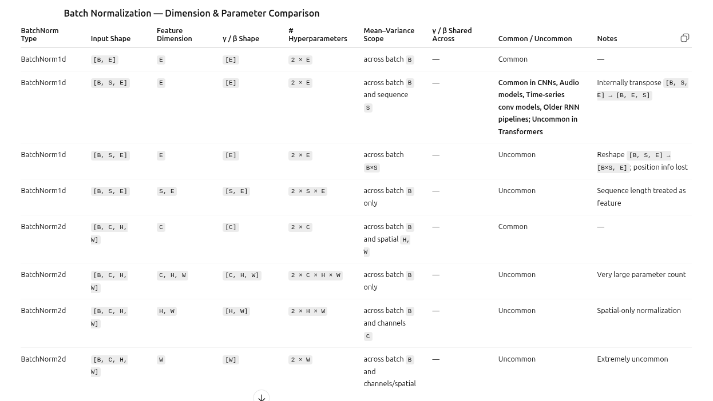 
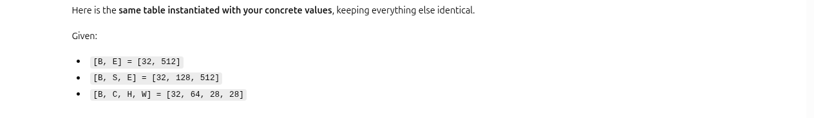 
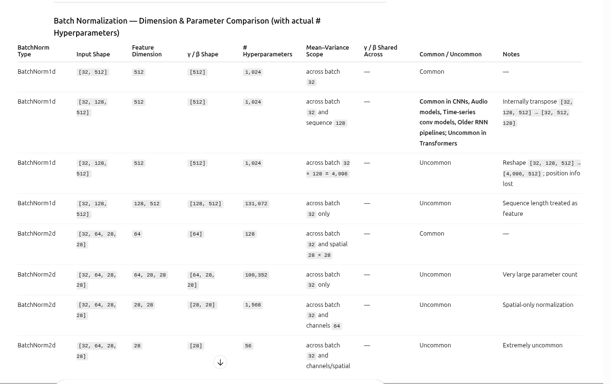

#### Why is Row2 Common but Row3 Uncommon, even though mathematically they are the same
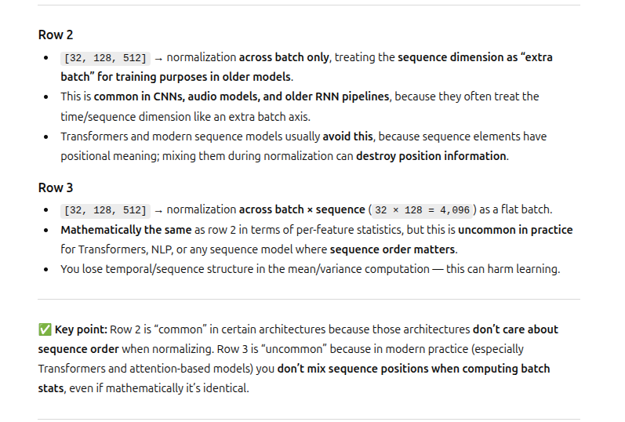


## 🟢 III. Batch Norm1D : Detailed Example on [B,S,E], reshaped to [B*S,E]

- Batch Norm is rarely used on embeddings. This example is purely for demonstration only and to compare against layernorm
- Reshaping [B, S, E] → [B·S, E] makes BatchNorm treat all tokens as one big batch, discarding sequence structure. ⚠️ It changes the meaning of normalization.   ❌ Usually not desirable for sequence models
- Batch Norm is typically calculated per channel. In this case the embedding dimensions act as the channel
- Number of Learned Parameters = 2*E

### 📗 Step1: normalization before using β and γ
```
import torch
import torch.nn as nn


batch_length = 2 # There are 2 samples in this batch
sentence_length = 3
embedding_dim = 4
embedding = [
    [ [1.0, 2.0, 3.0, 4.0],   # batch 0, token 0, Hello!
      [2.0, 4.0, 6.0, 8.0],   # batch 0, token 1, Good 
      [20.0, 9.0, 2.0, 0.1]], # batch 0, token 2, Morning.

    [ [0.0, 5.0, 10.0, 150.0], # batch 1, token 0, Bye!
      [1.0, 1.0, 1.0, 1.0],    # batch 1, token 1, Cya
      [2.0, 3.0, 4.0, 5.0] ]   # batch 1, token 2, Tomorrow.
]

x = torch.tensor(embedding, dtype=torch.float32)
B, S, E = x.shape

batch_norm = nn.BatchNorm1d(E)

# reshape to (B*S, E)
x_reshaped = x.view(B * S, E)

y = batch_norm(x_reshaped)

# reshape back to (B, S, E)
y = y.view(B, S, E)

print(y.shape)  # torch.Size([2, 3, 4])

```

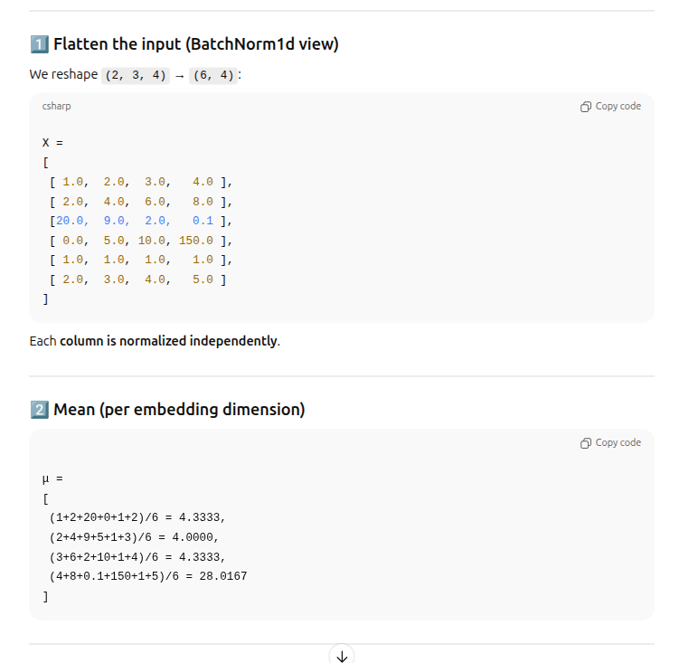 
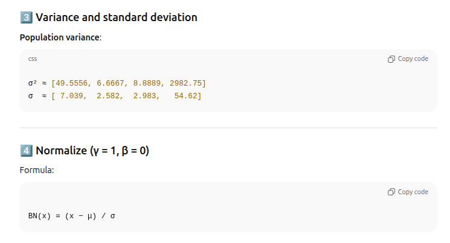 
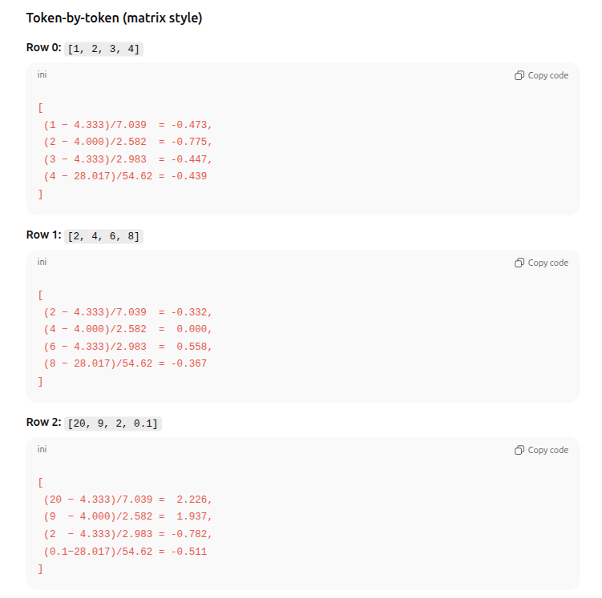 
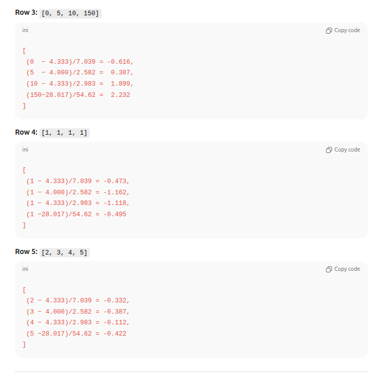 
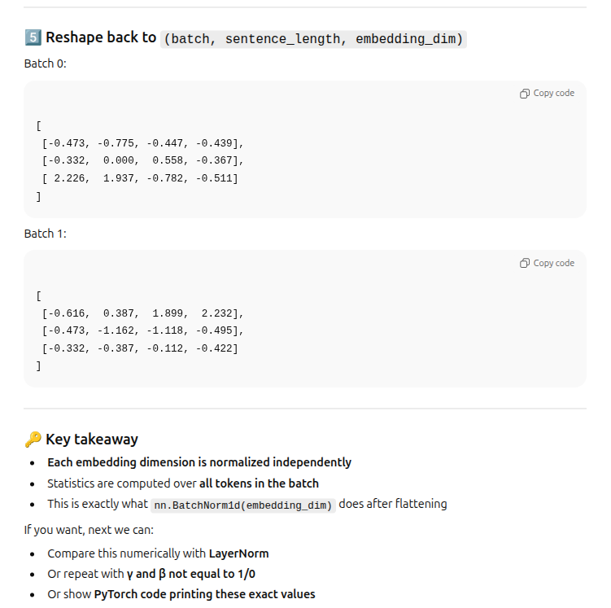 


### 📗 Step2: Apply β and γ
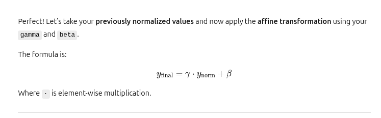 
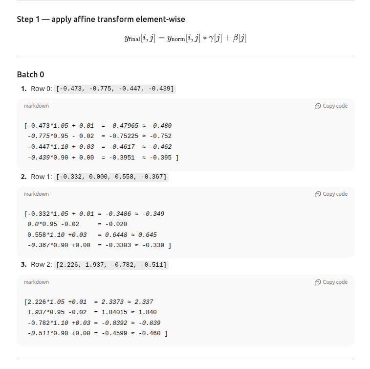 
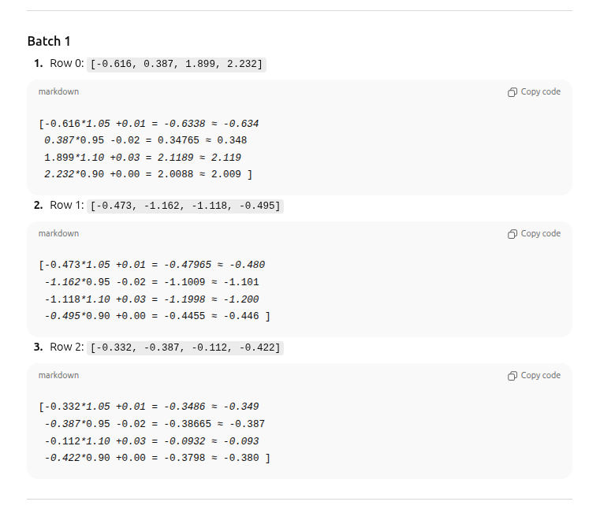 
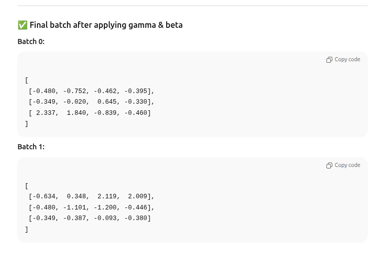 


```
embedding = [
    [ [1.0, 2.0, 3.0, 4.0],   # sample 0, token 0, Hello!
      [2.0, 4.0, 6.0, 8.0],   # sample 0, token 1, Good 
      [20.0, 9.0, 2.0, 0.1]], # sample 0, token 2, Morning.

    [ [0.0, 5.0, 10.0, 150.0], # sample 1, token 0, Bye!
      [1.0, 1.0, 1.0, 1.0],    # sample 1, token 1, Cya
      [2.0, 3.0, 4.0, 5.0] ]   # sample 1, token 2, Tomorrow.
]

batch_normalized_embedding_without_βγ = [
    [ [-0.473, -0.775, -0.447, -0.439],  # sample 0, token 0, Hello!
      [-0.332,  0.000,  0.558, -0.367],   # sample 0, token 1, Good 
      [ 2.226,  1.937, -0.782, -0.511]]   # sample 0, token 2, Morning.

    [ [-0.616,  0.387,  1.899,  2.232], # sample 1, token 0, Bye!
      [-0.473, -1.162, -1.118, -0.495],         # sample 1, token 1, Cya
      [-0.332, -0.387, -0.112, -0.422]] # sample 1, token 2, Tomorrow.
]

gamma = [1.05, 0.95, 1.10, 0.90]
beta  = [0.01, -0.02, 0.03, 0.00]

batch_normalized_embedding_with_βγ = [
    [ [-0.480, -0.752, -0.462, -0.395],   # sample 0, token 0, Hello!
      [-0.349, -0.020,  0.645, -0.330],   # sample 0, token 1, Good 
      [ 2.337,  1.840, -0.839, -0.460]]   # sample 0, token 2, Morning.

    [ [-0.634,  0.348,  2.119,  2.009],  # sample 1, token 0, Bye!
      [-0.480, -1.101, -1.200, -0.446],  # sample 1, token 1, Cya
      [-0.349, -0.387, -0.093, -0.380]]  # sample 1, token 2, Tomorrow.
]
```


## 🟢 IV. Batch Norm : NOT Same During Training And Inference
**mode.train() != mode.eval**
- Its not because beta and gamma are updated during training(perhaps that too). See model.train() vs model.eval() notes under README_LayerNorm.md. model.train() does not affect hyperparameters unless backpropagation and optimizer are called
- Assuming backpropagation and optimizer are not called , even then batch-norm-train != batch-norm-eval
- This is because during training , for every single batch the (mean,variance) = (μ_batch, σ²_batch) is calculated using all the data samples within that batch only. 
  - Batch0 = (μ0_batch, σ²0_batch) calculated using all the samples in the batch 0 
  - Batch1 = (μ1_batch, σ²1_batch) calculated using all the samples in the batch 1 etc.
  - Hence every Batch has a different mean and variance μi_batch, σ²i_batch(even when back propagation and optimizer are not used)
- Simultaneously in model.train() mode running_mean and running_variance are updated. (even when back propagation and optimizer are not used).  They are not used in training mode, but they could be used later in eval/ inference mode . 
- The running_mean and running_varaince are buffered values (stored in the model ???.). They are not 
- In eval mode, every batch, no matter the batch size uses running_mean and running_variance only. 
  - Batch0 : uses [running_mean, running_variance]
  - Batch1 : uses [running_mean, running_variance]
  - All batches : use the same [running_mean, running_variance]
 

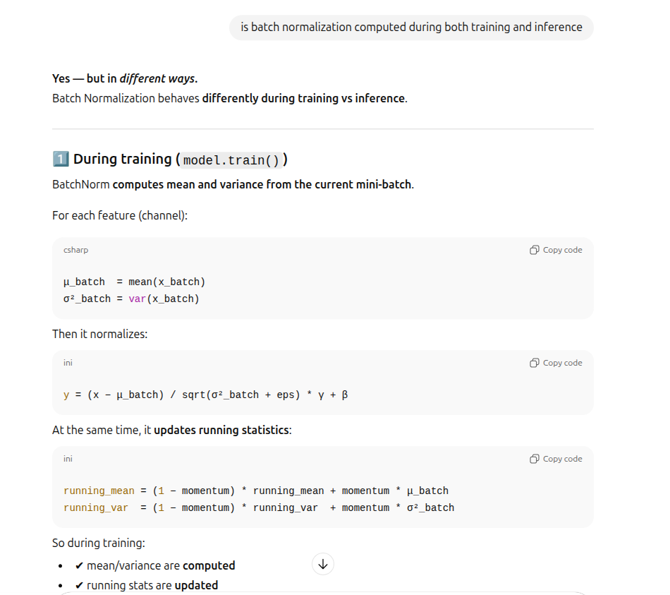 
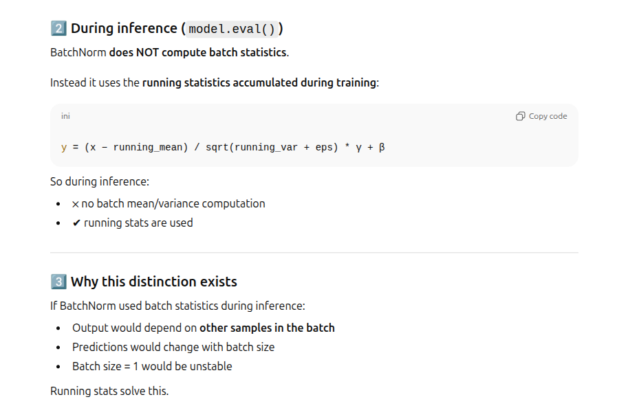 
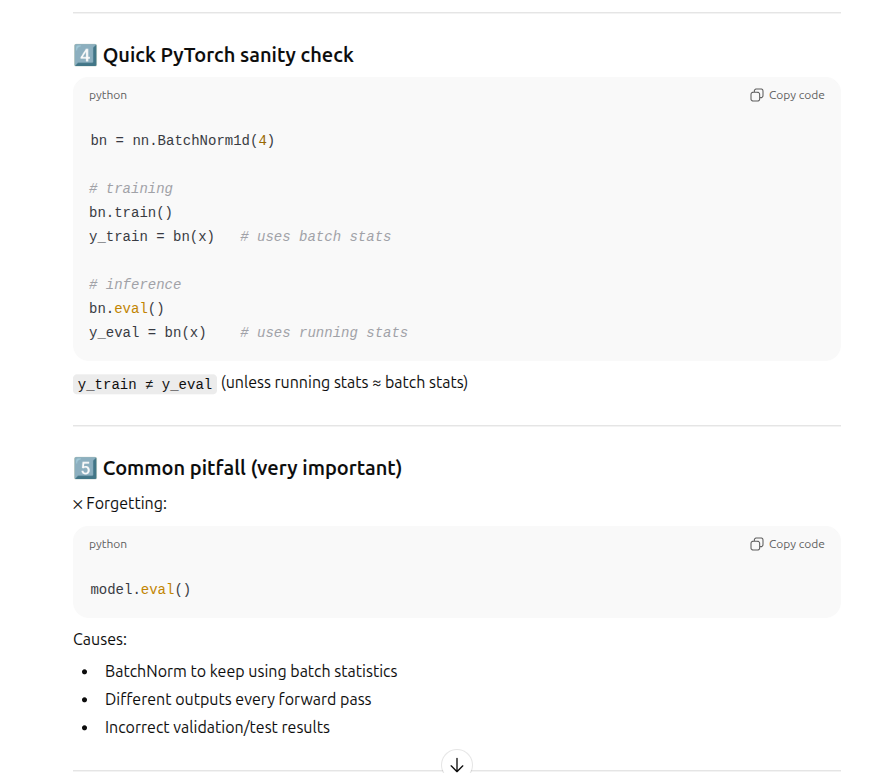

## 🟢 IV. Batch Norm : Momentum in Batch Statistics

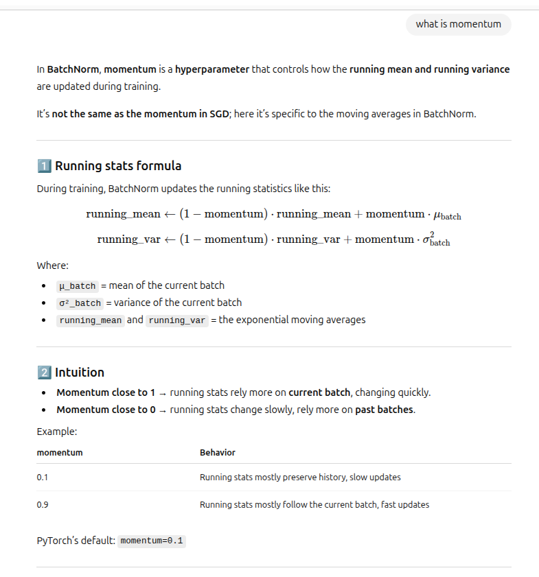 
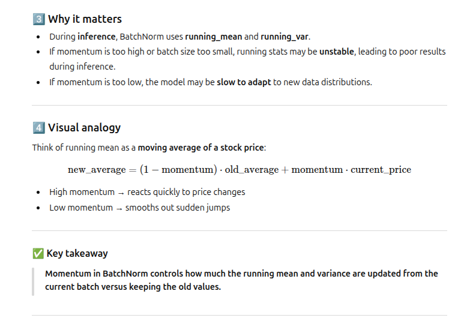


