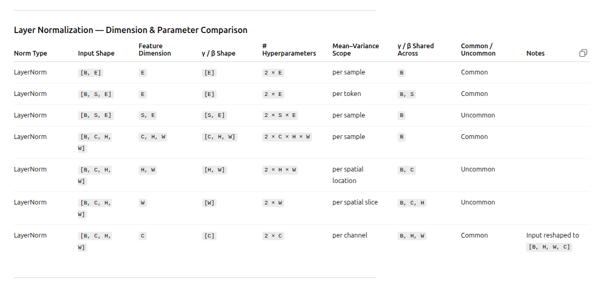
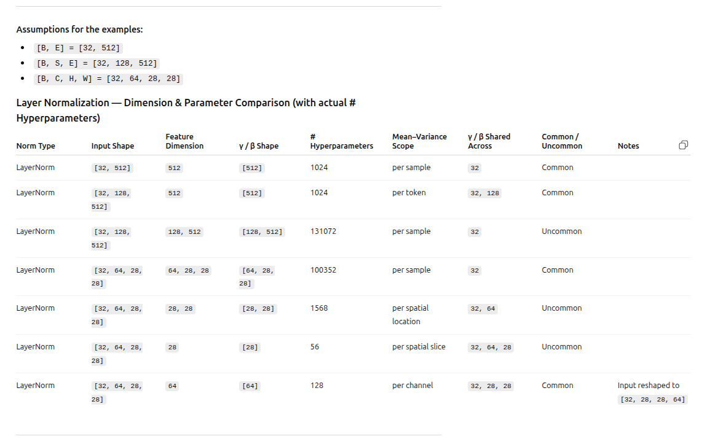

# 🟢 LAYER NORM

## 🟢 I. Layer Norm : TLDR
- Transformers use a lot of Layer Norm. \
- Refer pytorch documentation [here](https://docs.pytorch.org/docs/stable/generated/torch.nn.LayerNorm.html) 
- Layer Norm can be used for tensors of any shape. But in practice, LayerNorm is almost always applied along the embedding / feature dimension -**E**
  - LayerNorm normalizes over the last k dimensions you specify.**The dimensions should be at the end of the input. i.e Input (N,∗). **
  - Whereas Batch Norm is always along the number_of_channels **C**. When using a combination of Transformers and CNNs, it is common to treat the embedding_dimension as the number_of_channels. So **E=C**
  - BatchNorm1D,  BatchNorm2D, BatchNorm3D all expect **C to be the second dimension**. i.e Input(N,C,*). Hence when moving between transformers and CNNs, it is necessary to frequently reshape from [B,S,E] to [B*S,E] or [B,E,S]
- **Layer Norm Per Sample:** Layer Norm doesn't care about batches, different tokens. 
  - Key nuance in understanding, is that in Layer Norm the mean and variance is taken per sample. It is averaged across all dimensions of one token.But the beta and gamma are calculated one pair per feature dimension . So [mean,variance] & [beta, gamma] are calculated along two different directions
  - For batch norm both the [mean, variance] and [beta, gamma] are along the feature dimension (so both same direction)
- **Hyper Parameters:** 
  - 1 beta and 1 gamma per dimension are the learned hyper parameters. #hyper_parameters = 2*dimension
  - mean and variance are on a per sample basis, and hence not learned hyperparameters (they are not hyper parameters for batch normalization either)
- Common variant = standard usage in PyTorch literature; uncommon variants are technically valid but rarely used
- Output shape matches input shape


## 🟢 II. Layer Norm : Which Dimension To Use ?
- When LayerNorm is used, Input Shape (N, *) = Output Shape (N, *)

- For all cases below, mean and variance are computed independently per sample element,
  reduced over the specified normalized (feature) dimensions.

- Input X shape = [B, E], Output = [B, E]
  - nn.LayerNorm(E):
    - Normalization over last dimension [E]
    - β and γ per [E], shared across [B] 
    - common pytorch usage 

- Input X shape = [B, S, E], Output = [B, S, E]
  - nn.LayerNorm(E):
    - Normalization over last dimension [E] (per token)
    - β and γ per [E], shared across [B, S] 
    - common pytorch usage. 
  - nn.LayerNorm([S, E]):
    - Normalization over last two dimensions [S, E]
    - β and γ per [S, E], shared across [B]
    - uncommon pytorch usage. Technically valid but usually poor design

- Input X shape = [B, C, H, W], Output = [B, C, H, W]
  - nn.LayerNorm([C, H, W]):
    - Normalization over last three dimensions [C, H, W]
    - β and γ per [C, H, W], shared across [B] (PyTorch documentation)
  - nn.LayerNorm([H, W]):
    - Normalization over last two dimensions [H, W]
    - β and γ per [H, W], shared across [B, C]
    - uncommon pytorch usage. Technically valid but usually poor design
  - nn.LayerNorm([W]):
    - Normalization over last dimension [W]
    - β and γ per [W], shared across [B, C, H]
    - uncommon pytorch usage. Technically valid but usually poor design

  - CNN STYLE: To apply layer norm on the number of Channels 
    - used in architectures where CNN and Transformers are both used in the model
    - check vitsilip code. There might be some use cases there ??
    - If X shape = [B,C,H,W], LayerNorm(X) shape = [B,C,H,W]. Layenorm along [C]: 
      - Reorder the input to [B,H,W,C] to  apply layer norm along [C] which is the last dimension
      - without reordering of input shapeINVALID , RUNTIME ERROR . The last dimension is [W] not [C]. So unless by coincidence [C] = [H]. This will error out.


Below are the results tabulated
**Layer Normalization — Dimension & Parameter Comparison**
| Norm Type | Input Shape    | Feature Dimension | γ / β Shape | # Hyperparameters | Mean–Variance Scope  | γ / β Shared Across | Common / Uncommon | Notes                            |
| --------- | -------------- | ----------------- | ----------- | ----------------- | -------------------- | ------------------- | ----------------- | -------------------------------- |
| LayerNorm | `[B, E]`       | `E`               | `[E]`       | `2 × E`           | per sample           | `B`                 | Common            |                                  |
| LayerNorm | `[B, S, E]`    | `E`               | `[E]`       | `2 × E`           | per token            | `B, S`              | Common            |                                  |
| LayerNorm | `[B, S, E]`    | `S, E`            | `[S, E]`    | `2 × S × E`       | per sample           | `B`                 | Uncommon          |                                  |
| LayerNorm | `[B, C, H, W]` | `C, H, W`         | `[C, H, W]` | `2 × C × H × W`   | per sample           | `B`                 | Common            |                                  |
| LayerNorm | `[B, C, H, W]` | `H, W`            | `[H, W]`    | `2 × H × W`       | per spatial location | `B, C`              | Uncommon          |                                  |
| LayerNorm | `[B, C, H, W]` | `W`               | `[W]`       | `2 × W`           | per spatial slice    | `B, C, H`           | Uncommon          |                                  |
| LayerNorm | `[B, C, H, W]` | `C`               | `[C]`       | `2 × C`           | per channel          | `B, H, W`           | Common            | Input reshaped to `[B, H, W, C]` |


**Layer Normalization — Dimension & Parameter Comparison (with actual # Hyperparameters)**

Assumptions for the examples:
- [B, E] = [32, 512]
- [B, S, E] = [32, 128, 512]
- [B, C, H, W] = [32, 64, 28, 28]

Takeaway
- Notice how the dimension choice exponentially increases /decreases the number of parameters


| Norm Type | Input Shape        | Feature Dimension | γ / β Shape    | # Hyperparameters | Mean–Variance Scope  | γ / β Shared Across | Common / Uncommon | Notes                                |
| --------- | ------------------ | ----------------- | -------------- | ----------------- | -------------------- | ------------------- | ----------------- | ------------------------------------ |
| LayerNorm | `[32, 512]`        | `512`             | `[512]`        | 1024              | per sample           | `32`                | Common            |                                      |
| LayerNorm | `[32, 128, 512]`   | `512`             | `[512]`        | 1024              | per token            | `32, 128`           | Common            |                                      |
| LayerNorm | `[32, 128, 512]`   | `128, 512`        | `[128, 512]`   | 131072            | per sample           | `32`                | Uncommon          |                                      |
| LayerNorm | `[32, 64, 28, 28]` | `64, 28, 28`      | `[64, 28, 28]` | 100352            | per sample           | `32`                | Common            |                                      |
| LayerNorm | `[32, 64, 28, 28]` | `28, 28`          | `[28, 28]`     | 1568              | per spatial location | `32, 64`            | Uncommon          |                                      |
| LayerNorm | `[32, 64, 28, 28]` | `28`              | `[28]`         | 56                | per spatial slice    | `32, 64, 28`        | Uncommon          |                                      |
| LayerNorm | `[32, 64, 28, 28]` | `64`              | `[64]`         | 128               | per channel          | `32, 28, 28`        | Common            | Input reshaped to `[32, 28, 28, 64]` |





<br><br>

## 🟢 III. Layer Norm : Examples With Code, Various Dimension Inputs
#### 📗 Example 1: FC Layer of Image :Used in Nano VLM
- Layer Norm for input X of shape [B,E] = [20,64]
   - B = 20. Batch size is 20 i.e there are 20 samples in each batch .. 
   - E = 64. Embedding Dimension is 64. When the Image Patch has been converted to an embedding, x = [x0,x1,......x63]
- Layer Norm : nn.LayerNorm(embedding_dim) . This means it normalizes along the last dimension E per [B]. 
- - **# of Parameters:** 2 parameters gamma and beta per dimension. Hence 2*64 = 128 parameters
```
x= self.fc(x)             # [N, C=64]
x= self.layer_norm(x)
```

#### 📗 Example 2: NLP / Text Encoder of NanoVLM
- Layer Norm for input X of shape [B,S,E] = [20,5,64]
   - B = 20. Batch size is 20 i.e there are 20 samples in each batch .. 
   - S = 5. Sequence length a 5. Each sample's sequence length is 5. Ex. You must always dream big ( of course the words will in the form of tokens ??) 
   - E = 64. Embedding Dimension is 64. When the word has been converted to a token and then an embedding, each word will have a vector x of 64 dimensions x = [x0,x1,......x63]
- Layer Norm : nn.LayerNorm(embedding_dim) . This means it normalizes along the last dimension E per [B,S]. 
- **# of Parameters:** 2 parameters gamma and beta per dimension. Hence 2*64 = 128 parameters
```
batch_size, sentence_length, embedding_dim = 20, 5, 64
embedding = torch.randn(batch_size, sentence_length, embedding_dim)
layer_norm = nn.LayerNorm(embedding_dim)
# Activate module
layer_norm(embedding)
```
 
#### 📗 Example 3: Image (Not used in Nano VLM. Example from Pytorch documentation)
- Layer Norm for input X of shape [B,C,H,W] = [20,3,512,512]
   - B = 20. Batch size is 20 i.e there are 20 samples in each batch .. 
   - C = 3. Number of Channels Ex. RGB
   - H = 512. Height of Image
   - W = 512. Width of Image 
- Layer Norm : nn.LayerNorm([C,H,W]) . This means it normalizes along [C,H,W] per [B]. 
- **# of Parameters:** 2 parameters gamma and beta per dimension. Hence 2*C*H*W = 2*3*512*512 = 1572864 = 1.5 Million parameters
   - Notice how large the trainable parameters are in this case = **1.5 Million Trainable Parameters**
```
N, C, H, W = 20, 5, 10, 10
input = torch.randn(N, C, H, W)
# Normalize over the last three dimensions (i.e. the channel and spatial dimensions)
# as shown in the image below
layer_norm = nn.LayerNorm([C, H, W])
output = layer_norm(input)
```

<br><br>

## 🟢 IV. Layer Norm : Detailed Numerical Example on [B,S,E]
### 📗 Step1: Normalization before using β and γ
- Layer Norm works on individual tokens / individual vectors. 
- It does not care about all the samples in a batch. It does not care about the different words/tokens in one sentence either (assuming one word = one vector). Just take one vector and normalize it across its dimensions
- Hence the mean and variance are not learned hyper parameters (mean and variance are not learned hyper parameters in Batch Normalization either)
- Only Beta and Gamma are Learned Hyper Parameters (1 beta and 1 gamma per embed_dim = 2*embed_dim learnable hyper parameters)

```
'''
Layer Norm for input X of shape [B,S,E] = [2,3,4]
LayerNorm(embedding_dim=4) → normalize across last dimension per token.
Each token is normalized independently.
'''
batch_size = 2
sentence_length = 3
embedding_dim = 4
embedding = [
    [ [1.0, 2.0, 3.0, 4.0],   # sample 0, token 0, Hello!
      [2.0, 4.0, 6.0, 8.0],   # sample 0, token 1, Good 
      [20.0, 9.0, 2.0, 0.1]], # sample 0, token 2, Morning.

    [ [0.0, 5.0, 10.0, 150.0], # sample 1, token 0, Bye!
      [1.0, 1.0, 1.0, 1.0],    # sample 1, token 1, Cya
      [2.0, 3.0, 4.0, 5.0] ]   # sample 1, token 2, Tomorrow.
]
layer_norm = nn.LayerNorm(embedding_dim)
output = layer_norm(input)
```

**Sample 0, Token 0**
- toxen-x  : [1, 2, 3, 4]
- mean     : (1+2+3+4)/4 = 2.5
- variance :  ((1-2.5)² + (2-2.5)² + (3-2.5)² + (4-2.5)²)/4 = 1.25
- std      :  √1.25 ≈ 1.118
- normalized-x:(x-mean)/std = (x-2.5)/1.118 = [−1.342,−0.447,0.447,1.342]
- [mean, variance, std] (approx expected is 0,1,1) = [0,1,1]

**Sample 0, Token 1**
- token-x  : [2, 4, 6, 8]
- mean     : (2+4+6+8)/4 = 5
- variance : ((2-5)² + (4-5)² + (6-5)² + (8-5)²)/4 = (9+1+1+9)/4 = 5
- std      : √5 ≈ 2.236
- normalized-x:(x-mean)/std = (x-2.5)/1.118 = [−1.342,−0.447,0.447,1.342]
- normalized-x is same as Sample0, Token0 because Token1 is just a scaled version of Token0
- [mean, variance, std] (approx expected is 0,1,1) = [0,1,1]

**Sample 0, Token 2**
- token-x  : [20, 9, 2, 0.1]
- mean     : (20+9+2+0.1)/4 = 31.1/4 ≈ 7.775
- variance : ((20-7.775)² + (9-7.775)² + (2-7.775)² + (0.1-7.775)²)/4 ≈ 60.79
- std      : √60.79 ≈ 7.8
- normalized-x:(x-mean)/std = (x-7.775)/7.8 = [1.565,0.157,−0.740,−0.983]
- [mean, variance, std] (approx expected is 0,1,1) = [0,1,1]


**Sample 1, Token 0**
- token-x  : [0, 5, 10, 150]
- mean     : (0+5+10+150)/4 = 165/4 = 41.25
- variance : ((0-41.25)² + (5-41.25)² + (10-41.25)² + (150-41.25)²)/4 = 3954.687
- std      : √3954.687 ≈ 62.886
- normalized-x:(x-mean)/std = (x-41.25)/ 62.96 =  [-0.656,-0.576,-0.497,1.729]
- [mean, variance, std] (approx expected is 0,1,1) = [0,1,1]

**Sample 1, Token 1**
- token-x  : [1.0, 1.0, 1.0, 1.0]
- mean     :1.0
- variance : 0.0
- std      : 0.0
- normalized-x: (divided by small epsilon) =  [0.0, 0.0, 0.0, 0.0]
- [mean, variance, std] (approx expected is 0,1,1) = [0,0,0]
- in this case variance and standard deviation is 0 (and not 1)

**Sample 1, Token 2**
- token-x  : [2.0, 3.0, 4.0, 5.0]
- mean     : (2+3+4+5)/4 = 3.5
- variance : ((2-3.5)² + (3-3.5)² + (4-3.5)² + (5-3.5)²)/4 = (2.25+0.25+0.25+2.25)/4 = 1.25
- std: 1.118
- normalized-x:(x-mean)/std = (x-3.5)/ 1.118 = [-1.342,-0.447,0.447,1.342]
- [mean, variance, std] (approx expected is 0,1,1) = [0,1,1]


### 📗Step2: Apply β and γ
```
Formula
output =γ⊙x + β

Lets use small beta and gamma
gamma = [1.05, 0.95, 1.10, 0.90]
beta  = [0.01, -0.02, 0.03, 0.00]
```
- There is one beta and gamma per dimension. In the example above embedding dimension = 4. So 4 betas, 4 gammas. Total 8 trainable parameters
- In the previous step notice that normalization has made [mean,variance] = [0,1] across all tokens (most tokens. one token has variance = 0)
- **Absolute Scale is Lost:** 
  - Sample0-Token0 and Sample0-Token1 have the same normalized vectors, though one is double the other. 
  - Scale is lost across one single X = [x0,x1...x63] vector, across its dimensions. But Gamma is on a per dimension basis, it is different for every dimension and will not uniformly scale x0, x1, x2, x3 etc. 
  - For vectors X = [x0,x1,x2,...x63], Y = [y0,y1,y2,...y63], Z = [z0,z1,z2,...z63] . Then γ= [γ0,γ1,γ2,...γ63], γ0 will scale x0,y0,z0 to the same extent. γ1 will scale x1,y1,z1 to the same extent. ...... γ63 will scale x63,y63,z63 to the same extent
- **Absolute Offset is Lost:** 
  - Sample0-Token0 and Sample1-Token2 have the same normalized vectors, though one is offset from the other by 1. In fact you could have a vector offset by 100 = [101,102,103,104]. It would still result in the same normalized vector. 
  - Offset is lost across one single X = [x0,x1...x63] vector, across its dimensions. But Beta is on a per dimension basis, it is different for every dimension and will not uniformly offset x0, x1, x2, x3 etc. 
  - For vectors X = [x0,x1,x2,...x63], Y = [y0,y1,y2,...y63], Z = [z0,z1,z2,...z63] . Then β= [β0,β1,β2,...β63], β0 will offset x0,y0,z0 to the same extent. β1 will offset x1,y1,z1 to the same extent. ...... β63 will offset x63,y63,z63 to the same extent
- Sample0-Token0 , Sample1-Token1, Sample1-Token2  will all look the same even after using β and γ. LOL. 😂  So β and γ only serve to maginify or diminish the dimensions ???. The do not restore the lost scale and offset 😆
- **output =γ⊙x + β** : is an **affine transform**. 
  - If you multiplied only by gamma and skipped the beta i.e. output =γ⊙x ,this would be a linear transform and only take care of the scale
  - Addition of the beta makes it affine

**Sample 0, Token 0**
- toxen-x  : [1, 2, 3, 4]
- normalized-x-without-βγ: [−1.342,−0.447,0.447,1.342]
- normalized-x-with-βγ   : [-1.399,-0.444,0.522,1.208]
```
Apply γ, β:
[
  1.05 * -1.342 + 0.01 = -1.399,
  0.95 * -0.447 - 0.02 = -0.444,
  1.10 *  0.447 + 0.03 =  0.522,
  0.90 *  1.342 + 0.00 =  1.208
] 
= [-1.399, -0.444, 0.522, 1.208]
```

**Sample 0, Token 1**
- token-x  : [2, 4, 6, 8]
- normalized-x-without-βγ : [−1.342,−0.447,0.447,1.342]
- normalized-x-with-βγ    : [-1.399,-0.444,0.522,1.208]
- normalized values same as Sample0-Token0 (despite the use of beta and gamma, no changes)


**Sample 0, Token 2**
- token-x  : [20, 9, 2, 0.1]
- normalized-x-without-βγ : [1.565,0.157,−0.740,−0.983]
- normalized-x-with-βγ    : [1.654,0.129,-0.784,-0.885]
```
Apply γ, β:
[
  1.05 *  1.565 + 0.01 =  1.654,
  0.95 *  0.157 - 0.02 =  0.129,
  1.10 * -0.740 + 0.03 = -0.784,
  0.90 * -0.983 + 0.00 = -0.885
]
= [1.654, 0.129, -0.784, -0.885]
```


**Sample 1, Token 0**
- token-x  : [0, 5, 10, 150]
- normalized-x-without-βγ : [-0.656,-0.576,-0.497,1.729]
- normalized-x-with-βγ    : [-0.679,-0.567,-0.517,1.556]
```
Apply γ, β:
[
  1.05 * -0.656 + 0.01 = -0.679,
  0.95 * -0.576 - 0.02 = -0.567,
  1.10 * -0.497 + 0.03 = -0.517,
  0.90 *  1.729 + 0.00 =  1.556
]
= [-0.679, -0.567, -0.517, 1.556]
```

**Sample 1, Token 1**
- token-x  : [1.0, 1.0, 1.0, 1.0]
- normalized-x-without-βγ: [0.0, 0.0, 0.0, 0.0]
- normalized-x-with-βγ   : [0.01, -0.02, 0.03, 0.00]
```
Apply γ, β:
[
  1.05 *  0.0 + 0.01 =  0.01,
  0.95 *  0.0 - 0.02 =  0.02,
  1.10 *  0.0 + 0.03 =  0.03,
  0.90 *  0.0 + 0.00 =  0.00
]
= [0.01, -0.02, 0.03, 0.00]
```

**Sample 1, Token 2**
- token-x  : [2.0, 3.0, 4.0, 5.0]
- normalized-x-without-βγ : [-1.342,-0.447,0.447,1.342]
- normalized-x-with-βγ    : [-1.399,-0.444,0.522,1.208]
- normalized values same as Sample0-Token0 (despite the use of beta and gamma, no changes)

```
embedding = [
    [ [1.0, 2.0, 3.0, 4.0],   # sample 0, token 0, Hello!
      [2.0, 4.0, 6.0, 8.0],   # sample 0, token 1, Good 
      [20.0, 9.0, 2.0, 0.1]], # sample 0, token 2, Morning.

    [ [0.0, 5.0, 10.0, 150.0], # sample 1, token 0, Bye!
      [1.0, 1.0, 1.0, 1.0],    # sample 1, token 1, Cya
      [2.0, 3.0, 4.0, 5.0] ]   # sample 1, token 2, Tomorrow.
]

layer_normalized_embedding_without_βγ = [
    [ [−1.342,−0.447,0.447,1.342],   # sample 0, token 0, Hello!
      [−1.342,−0.447,0.447,1.342],   # sample 0, token 1, Good 
      [1.565,0.157,−0.740,−0.983]]   # sample 0, token 2, Morning.

    [ [-0.656,-0.576,-0.497,1.729], # sample 1, token 0, Bye!
      [0.0, 0.0, 0.0, 0.0],         # sample 1, token 1, Cya
      [-1.342,-0.447,0.447,1.342] ] # sample 1, token 2, Tomorrow.
]

gamma = [1.05, 0.95, 1.10, 0.90]
beta  = [0.01, -0.02, 0.03, 0.00]

layer_normalized_embedding_with_βγ = [
    [ [-1.399,-0.444,0.522,1.208],   # sample 0, token 0, Hello!
      [-1.399,-0.444,0.522,1.208],   # sample 0, token 1, Good 
      [1.654,0.129,-0.784,-0.885]]   # sample 0, token 2, Morning.

    [ [-0.679,-0.567,-0.517,1.556], # sample 1, token 0, Bye!
      [0.01, -0.02, 0.03, 0.00],    # sample 1, token 1, Cya
      [-1.399,-0.444,0.522,1.208] ] # sample 1, token 2, Tomorrow.
]
```
<br><br>

## 🟢 IV. Layer Norm : Same During Training And Inference
- Layer Norm is the same during training and Training
Sample Code and Explanation Below


- But how is layer norm the same using training and inference , if beta and gamma are learned during training

 
 
 
 
 


# 🟢 train() vs eval()

Takeaway
- train() does not alter hyper parameters unless backpropgation is done
- eval() does not freeze parameters
 


